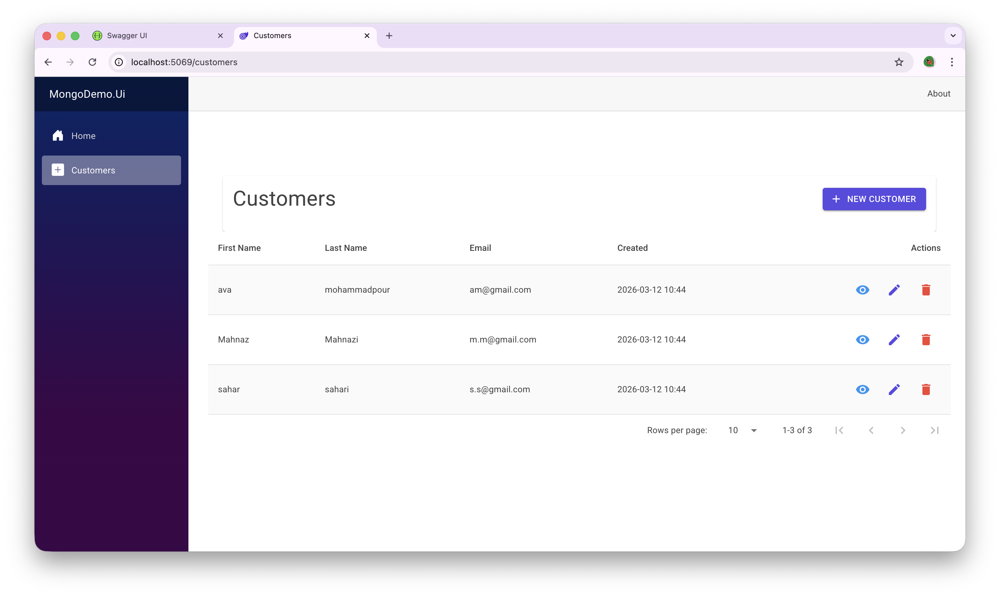
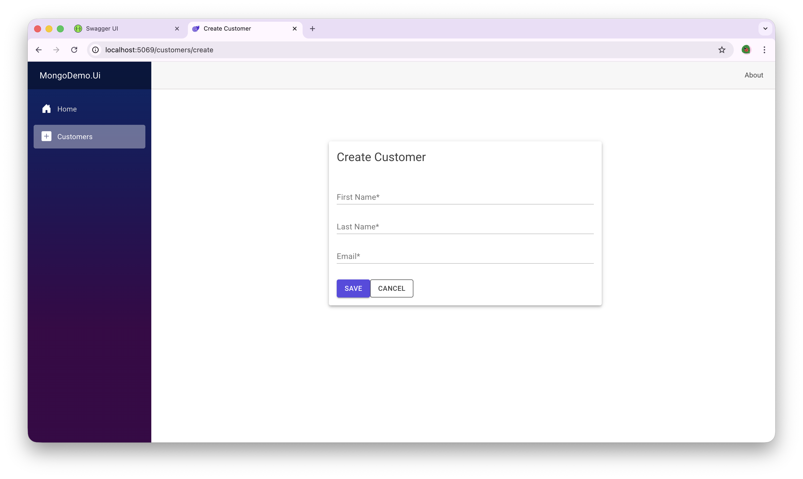
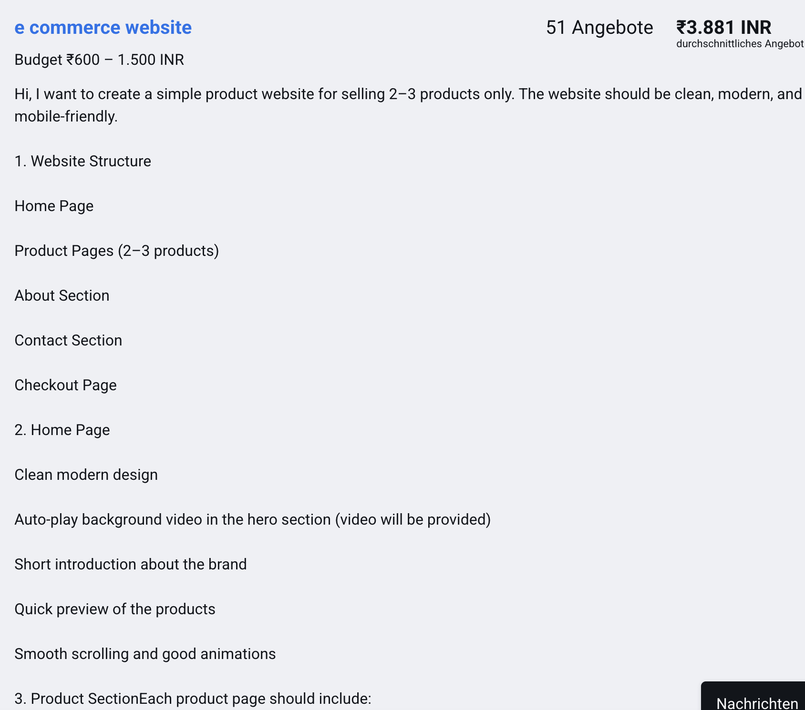
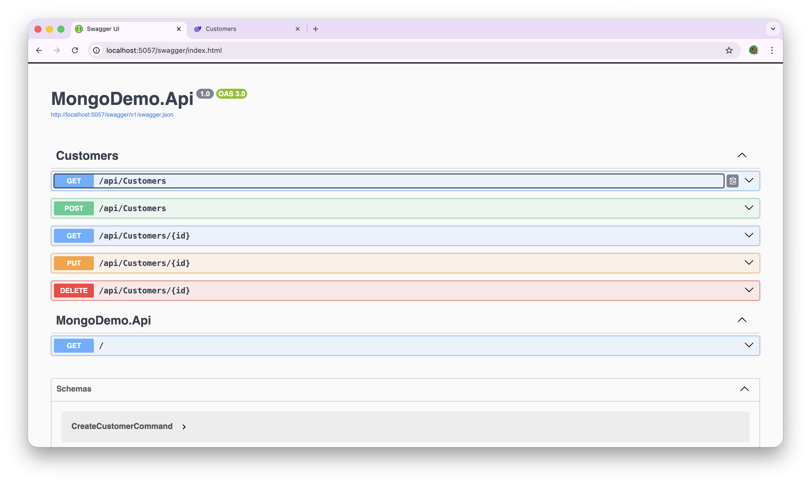

## Overview

Full-stack .NET sample demonstrating Clean Architecture, MongoDB integration, Blazor UI, CQRS, and Docker containerization.

# MongoDemo – Clean Architecture Full-Stack .NET Application


MongoDemo is a full-stack sample application built with ASP.NET Core Web API, Clean Architecture principles, MongoDB, Blazor Web App, MudBlazor UI, and Docker Compose.

## UI Preview

<p>
  
  
</p>

<p>
  
  
</p>

## Docker Environment

The application runs in a multi-container Docker setup:

- Blazor UI container
- ASP.NET Core API container
- MongoDB container


## Architecture

The project follows Clean Architecture:

```
MongoDemo.Api → Presentation Layer  
MongoDemo.Application → Application Logic (CQRS / MediatR)  
MongoDemo.Domain → Domain Models  
MongoDemo.Infrastructure → MongoDB access  
MongoDemo.Ui → Blazor Web UI  
```

## Key Features

Customer Management:

- Create customer  
- Edit customer  
- Delete customer  
- View details  
- List view  

Technical:

- Clean Architecture
- CQRS (MediatR)
- MongoDB Repository Pattern
- Blazor UI
- MudBlazor Components
- Docker multi-container setup
- Dependency Injection

## Technologies

Backend:

• .NET 9  
• ASP.NET Core Web API  
• MediatR  
• MongoDB Driver  
• Clean Architecture  

Frontend:

• Blazor Web App  
• MudBlazor  
• HttpClient integration  

Infrastructure:

• Docker  
• Docker Compose  
• MongoDB container  

## Project Structure
```
MongoDemo
│
├── MongoDemo.Api
├── MongoDemo.Application
├── MongoDemo.Domain
├── MongoDemo.Infrastructure
└── MongoDemo.Ui
```

## Running with Docker (recommended)

Start everything:

```
docker compose up --build
```

Application URLs:

UI:
```
http://localhost:5069
```

API:
```
http://localhost:5057/swagger
```

MongoDB:
```
mongodb://localhost:27017
```

## Running without Docker

Run API:

```
cd MongoDemo.Api
dotnet run
```

Run UI:

```
cd MongoDemo.Ui
dotnet run
```

## Configuration

MongoDB settings are configured via:

appsettings.json

or environment variables:
MongoDb__ConnectionString
MongoDb__DatabaseName
MongoDb__CustomersCollectionName
API Base URL can be configured:
ApiSettings__BaseUrl

## Learning Goals

This project was built to practice:

• Clean Architecture in .NET  
• MongoDB integration  
• CQRS pattern  
• Blazor full-stack development  
• Docker containerization  
• Multi-container applications  

## Future Improvements

Possible extensions:

• Authentication (JWT / Identity)
• Validation (FluentValidation)
• Pagination
• Search
• Unit Tests
• Integration Tests
• CI/CD pipeline
• Mongo Express integration
• Logging improvements

## Author

Akram Mohammadpour  
.NET Developer | Software Architect | Blazor | Clean Architecture

LinkedIn:
(https://www.linkedin.com/in/ava-mohammadpour/)

## License

This project is for learning and demonstration purposes.